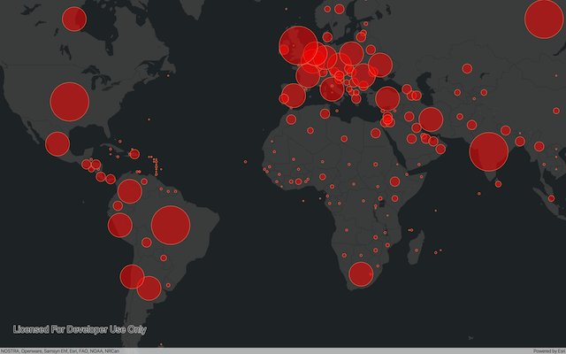
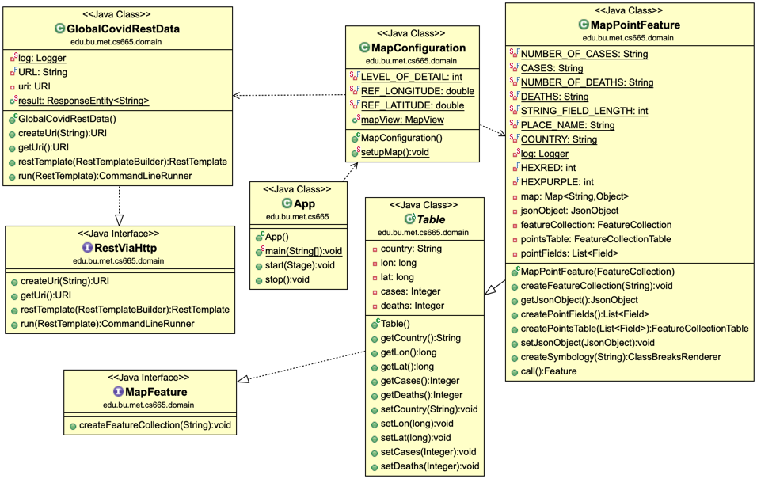

# PREVIEW



# MET CS665 - # MET CS665 - Project

https://github.com/metcs/met-cs665-assignment-project-a-bi-ok.git

[GitHub](https://github.com/metcs/met-cs665-assignment-project-a-bi-ok.git)

## COVID MAP APP - Using the Thread Pool Design Pattern
2 Project Tasks
2.1 Task 1 : Design pattern and its Use Case Scenario Description. (4 points)

The design pattern implemented is the thread pool design pattern. This design pattern is a performance type design pattern aimed at eliminating system latency by enforcing thread resource re-usability. The pattern uses a dynamically or statically determined number of available processors to create a thread pool from which individual tasks pool from for processing.

The COVID MAP APP is an application rooted in my personal GIS history. The application performs the functionality of rendering an interactive global map over-laid with live global Covid data. Covid data is sourced and accessed from an open source API via the NovelCOVID API on Github. The GIS base maps are sourced from an ESRI ArcGIS data repo.

The easiest way to develop a map is simply overlaying one map layer on top of the other. Layers are normally pre-styled vectors containing attributes. To be able to create a vector layer from a set of X, Y data, an application has to be able to transform X, Y data into vectors. In this case, the Covid JSON dataset which fortunately requires no geocoding. The process of reading each global Covid item and transforming it into a vector feature while styling is a system intensive process. This is why a Pool Design Pattern was implemented.

Below is a brief user story for the application interaction.
There are no required pre-conditions.

|  # |          user                 |                          system                      |
|----|-------------------------------|------------------------------------------------------|
|  1 | User runs application         | System collects global rest data from open API source|
|  2 |                               | System maps JSON data to TABLE OOject                |
|  3 |                               | System creates POINT FEATURES from TABLE obJECT      |
|  4 |                               | System reads and renders ARCGIS BASEMAP to GUI       |
|  5 |                               | System overlays a plot of point features on BASEMAP  |
|  6 | User pans display             | System renders display of panned area                |
|  7 | User zooms map                | System renders specific zoomed area                  |


### Non-Functional Constraints

|  # |                          system                       |
|----|-------------------------------------------------------|
|  1 |System shall require an ArcGIS API version 100.8.0     |
|  2 |System shall require a JavaFX version 11               |
|  3 |System shall require a Java JDK version 11             |
|  4 |System shall require a spring boot version 2.3.1       |
|  5 |System shall complete application launch under 30 secs |

The application's primary implementation goal is system resource optimization used in the MapPointFeature.java class. Another pattern captured in the implementation is a Facade design pattern designed into the MapConfiguration.java class, allowing the system to hide away lot of complexity from the user while actively facilitating the generation of the map's layers. The implemented design patterns together with the other OOP concepts give the application simplicity, flexibility, reliability, durability and re-usability.

Durability - is in the program's ability to implement encapsulation and using appropriate visibility modifiers like the use of the static modifier for the ResponseEntity<String> result field to share information across classes.

Reliability - is in the ability of the program to run without any signs of defects.

Information hiding - is in the program's Facade pattern implementation, efficiently hiding any evidence of the complexity embedded with the code, javafx and maven plugins and their dependencies.

Re-usability - is in the ability to use some of the interfaces and abstract class to create and add more layers to the map. There is also the ability to create new feature types using the provided interfaces  


Flexibility - is in the program's ability to implement a similar implementation using different data sources by only changing the URL string constant variable. The implementation also allows expansion to a features attribute by adding more fields to the Table.java class.


Understandability versus Simplicity - Despite the simplicity, refactoring and organization of the program, it still possess the challenge of easy understandability due to the technical nature of the entire infrastructure, naming, resources and the libraries.

There ultimate design goal of high cohesion and low coupling is evidently achieved.


2.2 Task 2 - UML Class Diagram. (5 points )

# UML




2.3 Task 4 - Implement your solution in Java (5 points )
Implemented and posted to git and 


MET CS665 - Assignment 6
 2.5 Task 5 - Record your presentation and upload a MP4 file. (5 points )
 MP4 uploaded


# Project Template

This is a Java Maven Project Template

# PRE COMPILATION STEPS steps.


## Optional Pre-compile steps.
mvn dependency:unpack

# How to compile the project

We use Apache Maven to compile and run this project. 

You need to install Apache Maven (https://maven.apache.org/)  on your system. 

Type on the command line: 

```bash
mvn clean compile
```

# How to create a binary runnable package 


```bash
mvn clean compile assembly:single
```


# How to run

```bash
mvn -q clean compile exec:java -Dexec.executable="edu.bu.met.cs665.Main" -Dlog4j.configuration="file:log4j.properties"
```

We recommand the above command for running the project. 

Alternativly, you can run the following command. It will generate a single jar file with all of the dependencies. 

```bash
mvn clean compile assembly:single

java -Dlog4j.configuration=file:log4j.properties -classpath ./target/JavaProjectTemplate-1.0-SNAPSHOT-jar-with-dependencies.jar  edu.bu.met.cs665.Main
```


# Run all the unit test classes.


```bash
mvn clean compile test

```

# Using Findbugs 

To see bug detail using the Findbugs GUI, use the following command "mvn findbugs:gui"

Or you can create a XML report by using  


```bash
mvn findbugs:gui 
```

or 


```bash
mvn findbugs:findbugs
```


For more info about FindBugs see 

http://findbugs.sourceforge.net/

And about Maven Findbug plugin see 
https://gleclaire.github.io/findbugs-maven-plugin/index.html


You can install Findbugs Eclipse Plugin 

http://findbugs.sourceforge.net/manual/eclipse.html


SpotBugs https://spotbugs.github.io/ is the spiritual successor of FindBugs.


# Run Checkstyle 

CheckStyle code styling configuration files are in config/ directory. Maven checkstyle plugin is set to use google code style. 
You can change it to other styles like sun checkstyle. 

To analyze this example using CheckStyle run 

```bash
mvn checkstyle:check
```

This will generate a report in XML format


```bash
target/checkstyle-checker.xml
target/checkstyle-result.xml
```

and the following command will generate a report in HTML format that you can open it using a Web browser. 

```bash
mvn checkstyle:checkstyle
```

```bash
target/site/checkstyle.html
```


# Generate  coveralls:report 

You can find more info about coveralls 

https://coveralls.io/

```bash
mvn -DrepoToken=YOUR-REPO-TOCKEN-ON-COVERALLS  cobertura:cobertura coveralls:report
```


